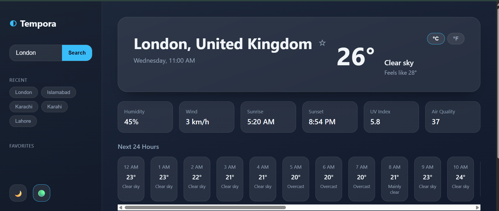
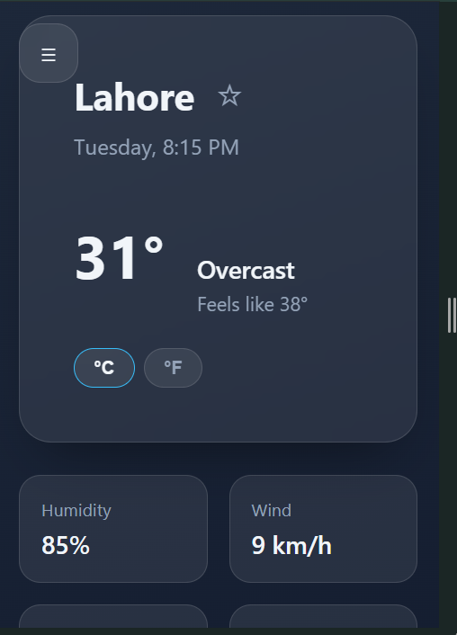
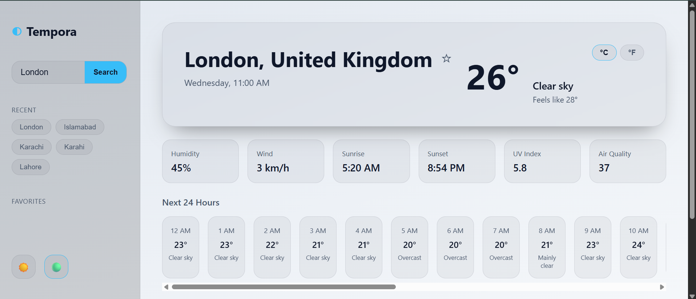
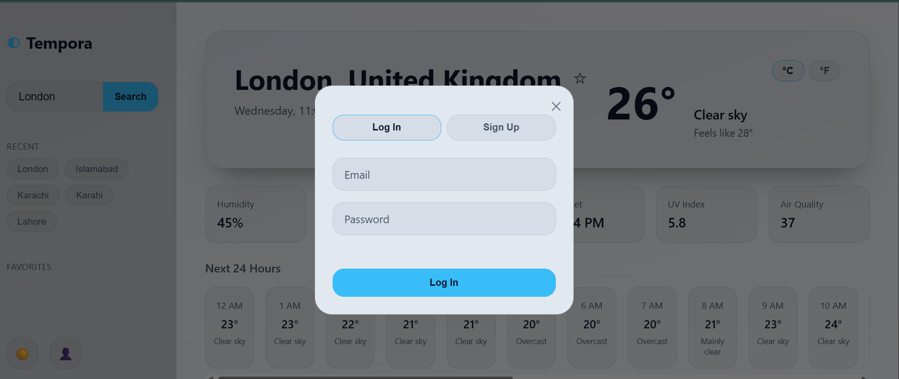

# 🌤️ Tempora

A full-stack weather dashboard with real-time forecasts, hourly and 5-day outlooks, UV/air-quality data, and persistent user accounts — built to demonstrate a complete frontend-to-database pipeline without relying on a frontend framework.

> Built by [Zunaira Zahid](https://github.com/Zunaira48)

---

## Features

- 🔍 **City search** with live current conditions, feels-like temperature, and condition icons
- ⏱️ **24-hour hourly forecast** — horizontally scrollable strip
- 📅 **5-day forecast**
- ☀️ **UV Index** and **Air Quality Index** (US EPA scale)
- 🌡️ **°C / °F toggle** — persists across sessions
- 🌗 **Dark / light theme** toggle
- 🔐 **Full user authentication** (JWT-based, SQL Server-backed)
- ⭐ **Favorite cities** — per-user, persisted server-side
- 🕓 **Recent searches** — auto-capped at 5, per-user, persisted server-side
- 📱 **Fully responsive** — sidebar navigation collapses to a mobile drawer

---

## Tech Stack

**Frontend:** vanilla HTML, CSS, JavaScript — no framework, no build step
**Backend:** FastAPI (Python), SQLAlchemy ORM
**Database:** Microsoft SQL Server
**Auth:** JWT (python-jose) + bcrypt password hashing (passlib)
**Weather data:** [Open-Meteo](https://open-meteo.com/) (forecast, geocoding, and air-quality APIs)

---

## Architecture

┌─────────────────┐ REST / JSON ┌──────────────────┐
│ Frontend (SPA) │ ─────────────────────────▶│ FastAPI backend │
│ HTML/CSS/JS │◀───────────────────────── │ │
└─────────────────┘ └─────────┬────────┘
│
┌──────────────────┼──────────────────┐
▼ ▼
┌───────────────────┐ ┌────────────────────┐
│ SQL Server │ │ Open-Meteo APIs │
│ (users, favorites,│ │ (weather, geocoding,│
│ recent_searches) │ │ air quality) │
└───────────────────┘ └────────────────────┘
Authentication is JWT-based: the backend issues a signed token on login/register, and the frontend attaches it as a `Bearer` header on every request to `/favorites` and `/recent-searches`, both of which are scoped to the authenticated user.

---

## Screenshots

| Desktop — Dashboard | Mobile — Sidebar |
|---|---|
|  |  |

| Light theme | Login |
|---|---|
|  |  |

---

## Project Structure

tempora/
├── backend/
│ ├── auth/
│ │ ├── security.py # password hashing, JWT create/decode
│ │ └── dependencies.py # get_current_user dependency
│ ├── routers/
│ │ ├── auth.py # /auth/register, /auth/login
│ │ ├── favorites.py # /favorites CRUD
│ │ └── recent_searches.py # /recent-searches CRUD
│ ├── schemas/
│ │ ├── weather.py
│ │ ├── auth.py
│ │ ├── favorites.py
│ │ └── recent_searches.py
│ ├── services/
│ │ ├── weather_service.py # Open-Meteo integration
│ │ └── weather_codes.py # WMO code → text/icon mapping
│ ├── database.py # SQLAlchemy engine/session
│ ├── models.py # User, Favorite, RecentSearch ORM models
│ ├── create_tables.py # one-time table creation script
│ └── main.py
├── frontend/
│ ├── css/style.css
│ ├── js/
│ │ ├── app.js
│ │ └── auth.js
│ └── index.html
└── docs/ # screenshots for this README


---

## Setup

### Prerequisites
- Python 3.13+
- Microsoft SQL Server (local instance is fine) + SSMS
- A SQL Server login with `dbcreator` role (or a pre-created database)
- VS Code with the Live Server extension (or any static file server) for the frontend

### 1. Clone and set up the backend

```powershell
git clone https://github.com/Zunaira48/tempora.git
cd tempora/backend
python -m venv venv
.\venv\Scripts\Activate.ps1
pip install -r requirements.txt
```

### 2. Create the database

In SSMS, connected as a login with `dbcreator` rights:

```sql
CREATE DATABASE TemporaDB;
```

### 3. Configure environment variables

Copy `.env.example` to `.env` in `backend/` and fill in your own values:

DB_SERVER=localhost
DB_NAME=TemporaDB
DB_USER=your_sql_username
DB_PASSWORD=your_sql_password
JWT_SECRET=generate_with_python_secrets_token_hex_32


Generate a secret:
```powershell
python -c "import secrets; print(secrets.token_hex(32))"
```

### 4. Create the tables

```powershell
python create_tables.py
```

### 5. Run the backend

```powershell
uvicorn main:app --reload
```

API is now live at `http://127.0.0.1:8000` (interactive docs at `/docs`).

### 6. Run the frontend

Open `frontend/index.html` with Live Server (defaults to `http://127.0.0.1:5500`), or any static server. The CORS origin is currently locked to `127.0.0.1:5500` / `localhost:5500` in `backend/main.py`.

---

## API Endpoints

| Method | Endpoint | Auth required | Description |
|---|---|---|---|
| GET | `/health` | No | Health check |
| GET | `/weather?city=` | No | Current weather + UV + AQI |
| GET | `/weather/forecast?city=` | No | 5-day forecast |
| GET | `/weather/hourly?city=` | No | 48-hour hourly forecast |
| POST | `/auth/register` | No | Create account, returns JWT |
| POST | `/auth/login` | No | Log in, returns JWT |
| GET | `/favorites` | Yes | List the current user's favorites |
| POST | `/favorites` | Yes | Add a favorite city |
| DELETE | `/favorites/{id}` | Yes | Remove a favorite |
| GET | `/recent-searches` | Yes | List the current user's last 5 searches |
| POST | `/recent-searches` | Yes | Record a search |

---

## Design Notes

A few intentional decisions worth mentioning if you're reading this as a code review:

- **UV Index** is sourced from Open-Meteo's daily max rather than an hourly value — it's the number that matters for same-day sun-safety decisions, and what most weather apps surface as "today's UV."
- **Air Quality** comes from a separate Open-Meteo Air Quality API call (different base URL from the main forecast). It's wrapped in a try/except so a transient AQI outage degrades to `—` instead of failing the whole `/weather` response.
- **Recent searches** re-insert on repeat search rather than just appending — searching a city that's already in your recent list bumps it to the top instead of creating a duplicate entry.
- **Favorites/recent searches require login** — since this data is now user-scoped in SQL Server rather than anonymous localStorage, an unauthenticated star-click opens the login modal rather than failing silently.

---

## Possible Future Additions

- Weather alerts / severe weather warnings
- Multi-language support
- PWA / offline support
- Wind direction compass visual

---

## Author

**Zunaira Zahid**
GitHub: [@Zunaira48](https://github.com/Zunaira48)

